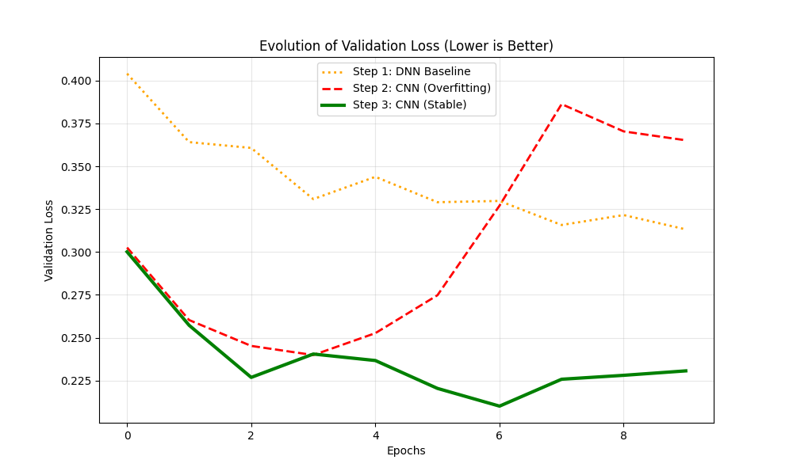
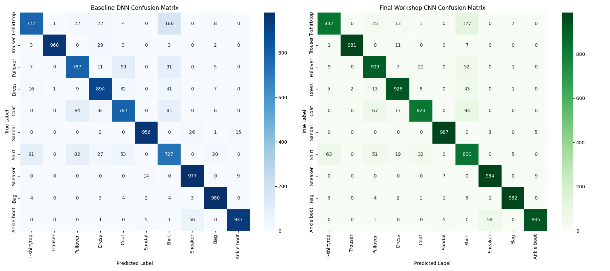

# Fashion-MNIST: Comparing Neural Network Architectures

Why do convolutional networks beat dense networks on images, and what does it take to stop them overfitting? This project trains and compares three models on the [Fashion-MNIST](https://github.com/zalandoresearch/fashion-mnist) dataset of 70,000 greyscale clothing images across 10 classes.

**Key result:** a VGG-style CNN with dropout reached **92% test accuracy**, compared with 89% for a dense baseline, and cut the train–test accuracy gap from **7.1 to 1.6 percentage points** compared with the same CNN without regularisation.

## Results

| Model | Train accuracy | Test accuracy | Observation |
|---|---|---|---|
| Baseline dense network (DNN) | 90.12% | 88.93% | Plateaus early; no spatial awareness |
| Unregularised CNN | 97.88% | 90.75% | Clear overfitting |
| VGG-style CNN with dropout | 93.93% | 92.37% | Best generalisation |

Test accuracy for the final model varied slightly between runs (91.9% to 92.4%). TensorFlow training is not fully deterministic even with fixed seeds, particularly on GPU.

### Overfitting, and how dropout fixed it



The unregularised CNN's validation loss starts rising after about epoch 3 while its training loss keeps falling, which is the classic sign of memorising the training data. The final model's validation loss stays low and stable.

### Where the model still struggles



The final CNN is highly reliable on distinctive shapes such as trousers, bags and sandals (F1 above 0.98). Shirts are the weakest class (F1 of 0.77), mostly confused with T-shirts, pullovers and coats. These garments share silhouettes and differ mainly in fine details like collars and buttons, which max pooling tends to blur at 28×28 resolution.

## Approach

- **Preprocessing:** pixel values normalised to [0, 1]; images flattened for the dense network and kept as 28×28×1 tensors for the CNNs.
- **Class balance check:** confirmed 6,000 training images per class, so accuracy is not inflated by a majority class.
- **Architectures:**
  - Dense baseline: 512 → 256 → 10 units.
  - Unregularised CNN: two convolution and max pooling blocks.
  - Final CNN: two VGG-style blocks of stacked 3×3 convolutions, with dropout after each block (0.25) and before the output layer (0.5).
- **Training:** Adam optimiser, sparse categorical cross-entropy, 10 epochs, batch size 64, 20% validation split, fixed random seeds.
- **Evaluation:** held-out 10,000-image test set, per-class precision, recall and F1, and confusion matrices.

## How to run

```bash
pip install -r requirements.txt
python fashion_mnist_cnn.py
```

The dataset downloads automatically through Keras. Training all three models takes a few minutes on a GPU and longer on a CPU. Plots and the classification report are saved to `results/`.

## Limitations and next steps

- Only 10 epochs with default hyperparameters; no systematic tuning.
- Results come from a single train/validation split, without confidence intervals.
- Possible improvements: data augmentation, batch normalisation, and higher-resolution inputs for fine-grained classes such as shirts.

## Tech stack

Python · TensorFlow · Keras · scikit-learn · pandas · NumPy · Matplotlib · seaborn

---

Developed as part of the MSc Artificial Intelligence at Northumbria University (AI Studio module).
